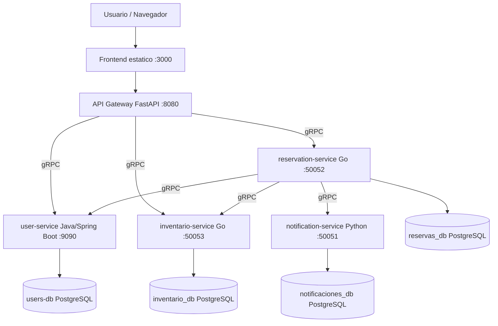
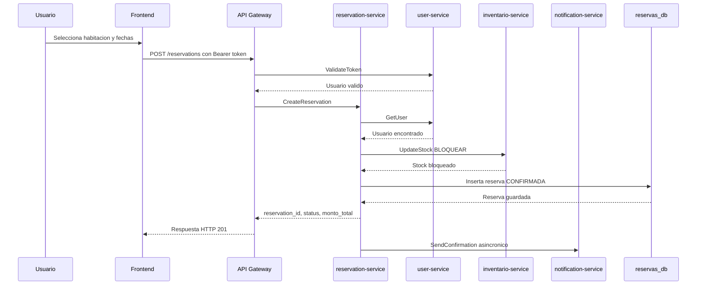

# Explicacion del Proyecto: Origen X

## 1. Resumen general

**Origen X** es una plataforma distribuida para la reserva de hoteles. El sistema permite que un usuario se registre, inicie sesion, busque habitaciones disponibles, cree reservas y reciba una notificacion de confirmacion.

El proyecto esta construido con una arquitectura de **microservicios**, donde cada servicio tiene una responsabilidad clara y, en general, una base de datos propia. La comunicacion externa se realiza por HTTP/REST mediante un API Gateway, mientras que la comunicacion interna entre servicios se realiza principalmente con **gRPC**.

## 2. Objetivo del sistema

El objetivo principal es simular una plataforma de reservas hoteleras usando conceptos de sistemas distribuidos:

- Separacion por microservicios.
- Comunicacion entre servicios mediante gRPC.
- Persistencia independiente por servicio.
- Coordinacion entre reservas, usuarios, inventario y notificaciones.
- Observabilidad mediante metricas, logs y trazas.
- Despliegue completo usando Docker Compose.

## 3. Arquitectura general

El sistema se organiza alrededor de un **API Gateway**, que recibe las solicitudes del frontend y las redirige a los microservicios internos.



## 4. Componentes principales

### Frontend

Ubicacion: `frontend/`

Es una interfaz web estatica hecha con HTML, CSS y JavaScript. Se sirve desde un contenedor Nginx y queda disponible en:

```text
http://localhost:3000
```

Funciones principales:

- Buscar habitaciones disponibles.
- Crear cuenta de usuario.
- Iniciar sesion.
- Crear reservas.
- Ver reservas del usuario autenticado.
- Ver y editar perfil.

El frontend consume directamente el API Gateway en:

```text
http://127.0.0.1:8080
```

### API Gateway

Ubicacion: `api-gateway/`

Servicio desarrollado en **Python con FastAPI**. Es el punto de entrada HTTP del sistema y traduce las peticiones REST del frontend hacia llamadas gRPC internas.

Endpoints principales:

| Metodo | Ruta | Descripcion |
|---|---|---|
| `GET` | `/health` | Verifica que el gateway este activo |
| `POST` | `/users` | Registra un usuario |
| `POST` | `/login` | Autentica un usuario |
| `POST` | `/logout` | Cierra la sesion |
| `POST` | `/validate-token` | Valida un token de sesion |
| `GET` | `/users/{user_id}` | Obtiene datos del usuario autenticado |
| `PUT` | `/users/{user_id}` | Actualiza datos del usuario autenticado |
| `POST` | `/api/inventory/search` | Busca habitaciones disponibles |
| `POST` | `/reservations` | Crea una reserva |
| `GET` | `/reservations` | Lista reservas del usuario autenticado |

El API Gateway tambien aplica CORS y validacion de sesion mediante tokens Bearer.

### user-service

Ubicacion: `user-service/`

Servicio desarrollado en **Java con Spring Boot**. Gestiona usuarios, autenticacion y sesiones.

Responsabilidades:

- Crear usuarios.
- Obtener datos de usuario.
- Actualizar perfil.
- Autenticar credenciales.
- Generar y validar tokens.
- Cerrar sesiones.

Persistencia:

- Base de datos PostgreSQL independiente: `users-db`.
- Hibernate/JPA con `ddl-auto: update` para desarrollo.

Comunicacion:

- Expone una interfaz gRPC en el puerto `9090`.
- Tambien expone endpoints de administracion Spring/Actuator en el puerto interno `8080`, mapeado como `8081` en Docker Compose.

### inventario-service

Ubicacion: `inventario-service/`

Servicio desarrollado en **Go**. Administra hoteles, tipos de habitaciones, precios, capacidad y stock disponible.

Responsabilidades:

- Buscar habitaciones disponibles segun filtros.
- Bloquear stock cuando se crea una reserva.
- Liberar stock cuando corresponde.

Filtros soportados:

- Ubicacion.
- Precio maximo.
- Capacidad.

Persistencia:

- Base de datos PostgreSQL independiente: `inventario_db`.
- Migraciones SQL en `inventario-service/migrations/`.
- Datos iniciales para hoteles y habitaciones.

Comunicacion:

- Expone gRPC en el puerto `50053`.
- El API Gateway lo usa para busquedas.
- El servicio de reservas lo usa para bloquear stock.

### reservation-service

Ubicacion: `mi-servicio/`

Servicio desarrollado en **Go**. Coordina el flujo principal de creacion y consulta de reservas.

Responsabilidades:

- Crear reservas.
- Listar reservas por usuario.
- Obtener una reserva por ID.
- Validar que el usuario exista antes de reservar.
- Bloquear inventario antes de confirmar la reserva.
- Guardar la reserva en PostgreSQL.
- Enviar una notificacion asincronica luego de confirmar.

Persistencia:

- Base de datos PostgreSQL independiente: `reservas_db`.
- Crea la tabla `reservations` al iniciar si no existe.

Comunicacion:

- Expone gRPC en el puerto `50052`.
- Consume gRPC de:
  - `user-service`
  - `inventario-service`
  - `notification-service`

### notification-service

Ubicacion: `notification_service/`

Servicio desarrollado en **Python** con gRPC. Gestiona las notificaciones generadas por el sistema, especialmente confirmaciones de reserva.

Responsabilidades:

- Recibir solicitudes de notificacion.
- Registrar eventos de notificacion.
- Evitar duplicados mediante idempotencia.
- Integrarse con Resend para envio de correos cuando existe configuracion.

Persistencia:

- Base de datos PostgreSQL independiente: `notificaciones_db`.

Diseno:

- Sigue una arquitectura hexagonal:
  - `core/`: dominio y puertos.
  - `infrastructure/`: adaptadores externos como PostgreSQL o Resend.
  - `grpc_interface/`: servidor gRPC.

## 5. Flujo principal de reserva

El flujo mas importante del proyecto es la creacion de una reserva:



Si el inventario no tiene stock suficiente, la reserva no se crea. Si falla el guardado en base de datos despues de bloquear stock, el servicio intenta liberar el stock nuevamente.

## 6. Comunicacion entre servicios

El sistema combina dos estilos de comunicacion:

| Tipo | Uso |
|---|---|
| REST/HTTP | Comunicacion externa desde frontend hacia API Gateway |
| gRPC | Comunicacion interna entre API Gateway y microservicios |

Esta separacion permite que el cliente web use una API sencilla, mientras los servicios internos mantienen contratos mas estrictos y eficientes mediante Protobuf.

## 7. Bases de datos

El proyecto aplica el patron **base de datos por servicio**:

| Servicio | Base de datos | Contenedor |
|---|---|---|
| user-service | `user_db` | `users-db` |
| inventario-service | `inventario_db` | `inventario_db` |
| reservation-service | `reservas_service` | `reservas_db` |
| notification-service | `notificaciones_db` | `notificaciones_db` |

Cada servicio es responsable de su propio modelo de datos. Esto reduce el acoplamiento entre servicios y permite evolucionarlos de forma independiente.

## 8. Observabilidad

El proyecto incluye una pila de observabilidad completa en la carpeta `observability/`.

Herramientas utilizadas:

| Herramienta | Puerto | Funcion |
|---|---:|---|
| Prometheus | `9091` | Recolectar metricas |
| Grafana | `3001` | Visualizar dashboards |
| Loki | `3100` | Almacenar logs |
| Promtail | - | Recolectar logs de contenedores |
| Tempo | `3200` | Almacenar trazas |
| OpenTelemetry Collector | `4319`, `4320` | Recibir y exportar trazas |

Los servicios exponen metricas Prometheus, por ejemplo:

- `reservation-service`: puerto `9102`.
- `inventario-service`: puerto `9103`.
- `notification-service`: puerto `9104`.
- `user-service`: endpoint Actuator/Prometheus.

Grafana queda disponible en:

```text
http://localhost:3001
```

Credenciales por defecto:

```text
usuario: admin
password: admin
```

## 9. Despliegue con Docker Compose

Desde la raiz del proyecto:

```bash
docker compose build --no-cache
docker compose up -d
docker compose ps
```

Servicios principales expuestos al host:

| Servicio | URL / Puerto |
|---|---|
| Frontend | `http://localhost:3000` |
| API Gateway | `http://localhost:8080` |
| user-service HTTP/Actuator | `http://localhost:8081` |
| user-service gRPC | `localhost:9090` |
| reservation-service gRPC | `localhost:50052` |
| inventario-service gRPC | `localhost:50053` |
| Prometheus | `http://localhost:9091` |
| Grafana | `http://localhost:3001` |
| Loki | `http://localhost:3100` |
| Tempo | `http://localhost:3200` |

## 10. Variables de entorno importantes

El proyecto incluye `.env.example` en la raiz. Variables relevantes:

```env
DB_USER=postgres
DB_PASSWORD=postgres
RESEND_API_KEY=
RESEND_FROM_EMAIL=onboarding@resend.dev
```

Tambien se configuran variables internas en `docker-compose.yml`, como:

- Hosts y puertos de cada base de datos.
- Hosts gRPC de los microservicios.
- Nombres de servicios para OpenTelemetry.
- Endpoints del collector de trazas.

## 11. Pruebas manuales rapidas

### Crear usuario

```bash
curl -X POST http://localhost:8080/users \
  -H "Content-Type: application/json" \
  -d '{"nombre":"Juan Perez","email":"juan@test.com","password":"pass","telefono":"123456"}'
```

### Iniciar sesion

```bash
curl -X POST http://localhost:8080/login \
  -H "Content-Type: application/json" \
  -d '{"email":"juan@test.com","password":"pass"}'
```

### Buscar habitaciones

```bash
curl -X POST http://localhost:8080/api/inventory/search \
  -H "Content-Type: application/json" \
  -d '{"fecha_inicio":"2026-07-10","fecha_fin":"2026-07-12","ubicacion":"","precio_max":0,"capacidad":2}'
```

### Crear reserva

Reemplazar `<ACCESS_TOKEN>`, `<HOTEL_ID>` y `<ROOM_TYPE_ID>` con valores reales:

```bash
curl -X POST http://localhost:8080/reservations \
  -H "Content-Type: application/json" \
  -H "Authorization: Bearer <ACCESS_TOKEN>" \
  -d '{"hotel_id":"<HOTEL_ID>","room_type_id":"<ROOM_TYPE_ID>","fecha_inicio":"2026-07-10","fecha_fin":"2026-07-12"}'
```

### Listar reservas

```bash
curl -H "Authorization: Bearer <ACCESS_TOKEN>" \
  http://localhost:8080/reservations
```

## 12. Fortalezas del proyecto

- Arquitectura distribuida con servicios separados por dominio.
- Uso de gRPC para contratos internos.
- API Gateway como punto unico de entrada.
- Persistencia aislada por microservicio.
- Contenedorizacion completa con Docker Compose.
- Flujo de reserva coordinado entre usuarios, inventario, reservas y notificaciones.
- Observabilidad con metricas, logs y trazas.
- Pruebas unitarias en servicios como inventario y notificaciones.

## 13. Posibles mejoras futuras

- Agregar cancelacion de reservas desde el API Gateway y frontend.
- Calcular `monto_total` segun precio real por noche y cantidad de dias.
- Modelar disponibilidad por fecha en inventario, no solo con `stock_total`.
- Usar mensajeria asincronica para notificaciones, por ejemplo RabbitMQ o Kafka.
- Homologar los contratos Protobuf para evitar duplicaciones entre carpetas.
- Agregar autenticacion/autorizacion mas robusta por roles.
- Incorporar pipeline CI para ejecutar tests automaticamente.

## 14. Conclusion

Origen X es un sistema de reservas hoteleras basado en microservicios que integra frontend, API Gateway, servicios gRPC, bases de datos independientes y una pila de observabilidad. El proyecto demuestra conceptos clave de sistemas distribuidos: comunicacion entre servicios, separacion de responsabilidades, tolerancia parcial a fallos, monitoreo y despliegue reproducible con contenedores.
