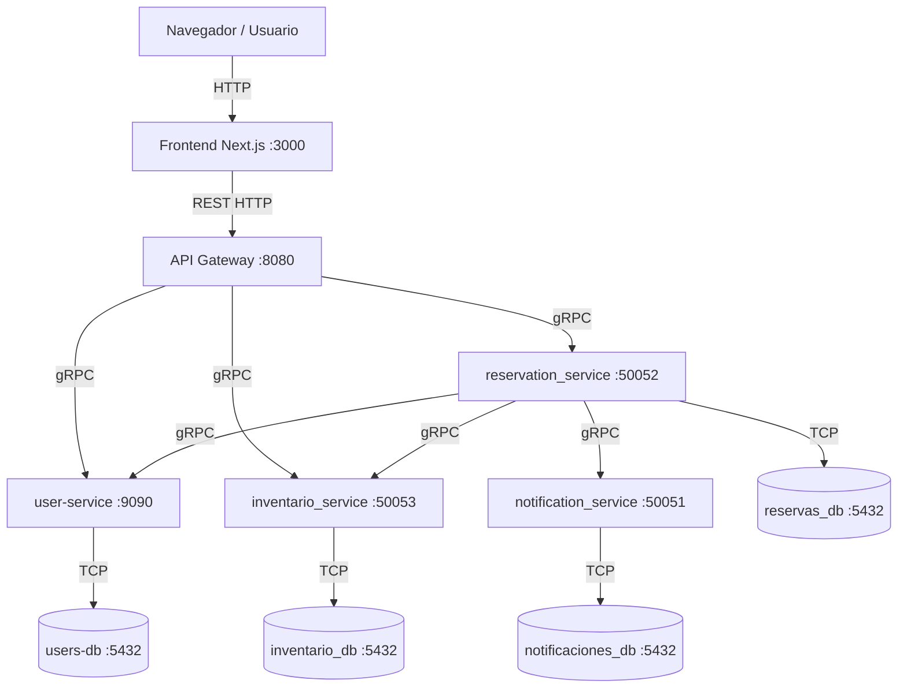

# Origen X - Sistema de Reserva de Hoteles

## 1. Descripción
Plataforma distribuida basada en microservicios para la gestión de reservas hoteleras. Permite el registro de usuarios, búsqueda de disponibilidad de habitaciones y creación de reservas con notificaciones automáticas.

### Tecnologías principales
*   **Backend:** Java (Spring Boot), Go, Python (FastAPI).
*   **Comunicación:** gRPC (Interno) y REST (Externo).
*   **Persistencia:** PostgreSQL (Base de datos por servicio).
*   **Infraestructura:** Docker / Docker Compose.
*   **Frontend:** Next.js / React.

---

## 2. Arquitectura resumida
El sistema utiliza un **API Gateway** como punto de entrada único, delegando las responsabilidades a servicios especializados con persistencia aislada.



---

## 3. Configuración y Despliegue

### Variables de Entorno (.env)
Asegúrese de configurar las siguientes variables mínimas:
```env
DB_USER=postgres
DB_PASSWORD=secretpassword
RESEND_API_KEY=re_123456789_dummy_key
RESEND_FROM_EMAIL=onboarding@resend.dev
```

### Levantamiento con Docker
```bash
# 1. Construir imágenes
docker compose build --no-cache

# 2. Iniciar servicios
docker compose up -d

# 3. Verificar estado
docker compose ps
```

---

## 4. Cómo probar el sistema

Para validar el funcionamiento del sistema, se pueden realizar peticiones directamente al **API Gateway** (`localhost:8080`). A continuación, se presentan ejemplos para entornos Windows (PowerShell) y Linux/macOS (curl).

### 4.1 Pruebas desde Terminal
Se proporcionan ambas versiones para asegurar la compatibilidad multiplataforma:
*   **Windows:** Se recomienda `Invoke-RestMethod` en PowerShell para un manejo nativo de objetos JSON.
*   **Linux/macOS:** Se recomienda `curl` por ser el estándar en sistemas tipo Unix.

**1. Crear un usuario:**
```powershell
Invoke-RestMethod -Uri "http://localhost:8080/users" -Method Post -Headers @{"Content-Type"="application/json"} -Body '{"nombre": "Juan Perez", "email": "juan@test.com", "password": "pass", "telefono": "123456"}'
```

```bash
curl -X POST http://localhost:8080/users \
     -H "Content-Type: application/json" \
     -d '{"nombre": "Juan Perez", "email": "juan@test.com", "password": "pass", "telefono": "123456"}'
```

**2. Login:**
```powershell
Invoke-RestMethod -Uri "http://localhost:8080/login" -Method Post -Headers @{"Content-Type"="application/json"} -Body '{"email": "juan@test.com", "password": "pass"}'
```

```bash
curl -X POST http://localhost:8080/login \
     -H "Content-Type: application/json" \
     -d '{"email": "juan@test.com", "password": "pass"}'
```

**3. Buscar habitaciones:**
```powershell
Invoke-RestMethod -Uri "http://localhost:8080/api/inventory/search" -Method Post -Headers @{"Content-Type"="application/json"} -Body '{"fecha_inicio": "2026-06-01", "fecha_fin": "2026-06-10", "ubicacion": "", "precio_max": 999999, "capacidad": 2}'
```

```bash
curl -X POST http://localhost:8080/api/inventory/search \
     -H "Content-Type: application/json" \
     -d '{"fecha_inicio": "2026-06-01", "fecha_fin": "2026-06-10", "ubicacion": "", "precio_max": 999999, "capacidad": 2}'
```

**4. Crear una reserva:**
*(Debes reemplazar los IDs con valores válidos obtenidos de los pasos anteriores).*
```powershell
Invoke-RestMethod -Uri "http://localhost:8080/reservations" -Method Post -Headers @{"Content-Type"="application/json"} -Body '{"user_id": "ID_DEL_USUARIO", "hotel_id": "HOTEL_1", "room_type_id": "ROOM_1", "fecha_inicio": "2026-06-01", "fecha_fin": "2026-06-10"}'
```

```bash
curl -X POST http://localhost:8080/reservations \
     -H "Content-Type: application/json" \
     -d '{"user_id": "ID_DEL_USUARIO", "hotel_id": "HOTEL_1", "room_type_id": "ROOM_1", "fecha_inicio": "2026-06-01", "fecha_fin": "2026-06-10"}'
```

**5. Listar reservas:**
```powershell
Invoke-RestMethod -Uri "http://localhost:8080/reservations" -Method Get
```

```bash
curl -X GET http://localhost:8080/reservations
```

### 4.2 Pruebas desde Interfaz Web (Frontend)
El sistema incluye un frontend web mínimo disponible en:
*   **URL:** `http://localhost:3000`

**Consideraciones:**
*   El frontend consume directamente el **API Gateway** expuesto en el puerto `8080`.
*   Permite validar visualmente parte del flujo (ej. listado de hoteles o disponibilidad).
*   **Nota Técnica:** Las pruebas por terminal (PowerShell/curl) siguen siendo las más completas para tareas de depuración y validación de las respuestas exactas de los microservicios.

### 4.3 Verificación de notificaciones

Las notificaciones del sistema se realizan internamente mediante comunicación gRPC. Cuando el `reservation_service` confirma una reserva, este invoca automáticamente al `notification_service`.

Para verificar que la integración es correcta y que las notificaciones se están procesando, puedes monitorear los logs del contenedor de notificaciones:

```bash
docker compose logs --tail 30 notification_service
```

**Resultado esperado:**
Deberías ver un log que confirme el procesamiento de la notificación, similar a:
```text
Notificación guardada: user=..., reservation=..., tipo=CONFIRMACION
```

---
