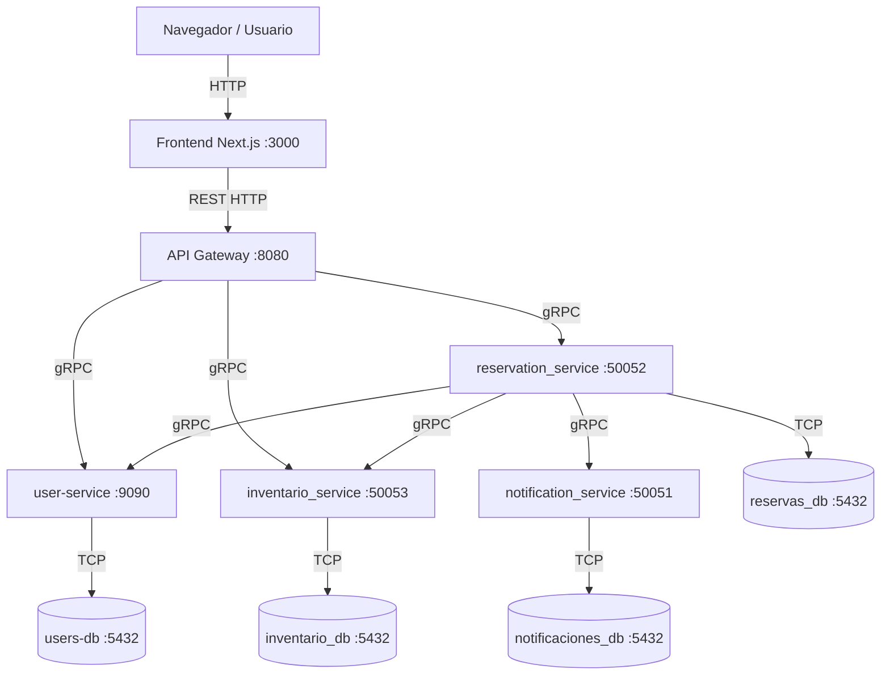

# Origen X - Sistema de Reserva de Hoteles

## 2. Descripción general

El sistema es una plataforma distribuida para la reserva de habitaciones de hotel. 

*   **¿Qué hace el sistema?** Permite a los usuarios registrarse, autenticarse, buscar disponibilidad de habitaciones según fechas y criterios, y crear reservas de hotel.
*   **¿Para quién está diseñado?** Para clientes finales que buscan alojamientos y para operadores hoteleros que necesitan un backend robusto y escalable.
*   **¿Qué problema resuelve?** Centraliza el inventario de hoteles y las reservas, manejando alta concurrencia y asegurando la integridad de las transacciones en un entorno distribuido.
*   **¿Qué tecnologías usa?** 
    *   **Backend:** Python (FastAPI), Java (Spring Boot), Go.
    *   **Comunicación:** REST (Externo) y gRPC (Interno).
    *   **Bases de Datos:** PostgreSQL.
    *   **Infraestructura:** Docker y Docker Compose.
    *   **Frontend:** React / Next.js.
*   **¿Por qué se eligió arquitectura de microservicios?** Para permitir que cada dominio del negocio (usuarios, inventario, reservas, notificaciones) escale, se despliegue y falle de manera independiente. Facilita la elección de la tecnología adecuada para cada problema (políglota) y aísla los datos para evitar cuellos de botella en una base de datos central.

---

## 3. Arquitectura del sistema

El sistema sigue una arquitectura orientada a microservicios, donde el acceso externo está mediado por un API Gateway.

### Componentes y Responsabilidades:

*   **Frontend:** Aplicación web (Next.js) orientada al usuario final.
*   **API Gateway:** Expone la API REST pública. Autentica, rutea y transforma las solicitudes HTTP a llamadas gRPC internas.
*   **user-service (Java/Spring Boot):** Gestiona el registro y autenticación de usuarios.
*   **inventario_service:** Mantiene el catálogo de hoteles, habitaciones y su disponibilidad por fechas.
*   **reservation_service:** Orquesta la creación de reservas. Se comunica con inventario, usuarios y notificaciones.
*   **notification_service:** Encargado de enviar correos electrónicos transaccionales (vía Resend).
*   **Bases de datos (PostgreSQL):** Cada servicio (users, inventario, reservas, notificaciones) tiene su propio contenedor PostgreSQL aislado.

### Comunicación:
*   **Cliente a API Gateway:** REST (JSON) sobre HTTP.
*   **API Gateway a Microservicios:** gRPC (Protobuf).
*   **Entre Microservicios:** gRPC.

---

## 4. Diagrama de arquitectura



---

## 5. Casos de uso y flujos de comunicación

### 1. Registro de usuario
*   **A) Capa Usuario:** El usuario envía su nombre, email y contraseña. Espera recibir un ID de usuario confirmando el registro exitoso.
*   **B) Capa Técnica:** 
    1. El cliente hace un `POST /users` al **API Gateway** (REST).
    2. El **API Gateway** traduce esto a una llamada gRPC `CreateUser` y contacta al **user-service**.
    3. El **user-service** aplica hashing a la contraseña y persiste el registro en **users-db** (PostgreSQL).

### 2. Login / Autenticación
*   **A) Capa Usuario:** El usuario ingresa email y contraseña. Espera recibir sus datos básicos si las credenciales son correctas.
*   **B) Capa Técnica:**
    1. El cliente hace un `POST /login` al **API Gateway** (REST).
    2. El **API Gateway** envía una solicitud gRPC `Authenticate` al **user-service**.
    3. El **user-service** consulta **users-db**, verifica el hash de la contraseña y retorna el resultado al Gateway.

### 3. Búsqueda de habitaciones
*   **A) Capa Usuario:** El usuario provee fechas de inicio, fin y opcionalmente ubicación/capacidad. Espera una lista de habitaciones disponibles.
*   **B) Capa Técnica:**
    1. El cliente hace un `POST /api/inventory/search` al **API Gateway** (REST).
    2. El **API Gateway** llama vía gRPC al **inventario_service**.
    3. El **inventario_service** consulta la base de datos **inventario_db** (PostgreSQL) verificando disponibilidad real en las fechas dadas y retorna la lista.

### 4. Creación de reserva
*   **A) Capa Usuario:** El usuario (ya logueado) selecciona un hotel, tipo de habitación y fechas, y confirma la reserva. Espera un ID de reserva y el monto total.
*   **B) Capa Técnica:**
    1. El cliente hace un `POST /reservations` al **API Gateway** (REST).
    2. El **API Gateway** llama vía gRPC al **reservation_service**.
    3. El **reservation_service** valida el usuario llamando al **user-service** (gRPC).
    4. El **reservation_service** descuenta el stock o valida disponibilidad llamando al **inventario_service** (gRPC).
    5. El **reservation_service** guarda la reserva en estado "Confirmada" en **reservas_db**.
    6. De forma asíncrona o sincrónica, llama al **notification_service** (gRPC) para enviar un correo, el cual se persiste en **notificaciones_db**.

---

## 6. Decisiones técnicas y trade-offs

*   **Arquitectura de Microservicios:**
    *   *Qué se gana:* Independencia de despliegue, aislamiento de fallos, y flexibilidad tecnológica.
    *   *Qué se sacrifica:* Complejidad operacional, latencia de red, costo alto de debugging distribuido y dificultad para mantener transacciones consistentes.
    *   *Alternativa descartada:* Monolito. Descartado porque acopla fuertemente los dominios y dificulta el escalado independiente del inventario vs notificaciones.

*   **API Gateway:**
    *   *Qué se gana:* Un único punto de entrada, simplifica el cliente (REST en lugar de gRPC en el navegador), centraliza CORS.
    *   *Qué se sacrifica:* Se añade un salto de red (hop) extra y un posible punto único de fallo (SPOF) si no se escala.
    *   *Alternativa descartada:* Exponer cada servicio directamente. Inviable por temas de seguridad, CORS y complejidad en el frontend.

*   **gRPC para comunicación interna:**
    *   *Qué se gana:* Tipado estricto (Protobuf), alta velocidad (binario sobre HTTP/2), bajo overhead.
    *   *Qué se sacrifica:* Curva de aprendizaje, dificultad para probar endpoints manualmente (requiere grpcurl en lugar de Postman/curl).
    *   *Alternativa descartada:* REST/JSON interno. Descartado por el mayor overhead de serialización en comunicaciones intensivas entre servicios.

*   **REST para comunicación externa (Frontend -> Gateway):**
    *   *Qué se gana:* Estándar universal, fácil consumo desde navegadores (Next.js/JS), fácil debugging.
    *   *Qué se sacrifica:* Ligeramente más verboso y pesado que gRPC-Web.
    *   *Alternativa descartada:* gRPC-Web. Descartado por requerir proxies adicionales (Envoy) y mayor complejidad en la configuración del cliente web.

*   **PostgreSQL por Servicio (Aislamiento de BD):**
    *   *Qué se gana:* Desacoplamiento total de esquemas. Un cambio en inventario no rompe a usuarios. Resiliencia.
    *   *Qué se sacrifica:* Dificultad para hacer JOINs. Consistencia eventual en lugar de transacciones ACID distribuidas (Two-Phase Commit). Si `reservation_service` guarda, pero `inventario_service` falla al descontar, requiere flujos de compensación (Sagas).
    *   *Alternativa descartada:* Base de datos compartida única. Descartada por ser un antipatrón en microservicios (acoplamiento a nivel de BD).

*   **Docker Compose:**
    *   *Qué se gana:* Orquestación simple para entornos de desarrollo e integración local, levanta todo con un comando.
    *   *Qué se sacrifica:* No apto para producción a gran escala (falta auto-scaling avanzado, rolling updates).
    *   *Alternativa descartada:* Kubernetes (Minikube). Descartado por el exceso de complejidad operativa para la fase actual del proyecto.

*   **Poliglotismo (Java en user-service, FastAPI en Gateway, Go/Python en el resto):**
    *   *Qué se gana:* Usar la mejor herramienta. FastAPI es excelente para I/O asíncrono y REST. Spring Boot tiene un ecosistema empresarial maduro para seguridad y persistencia.
    *   *Qué se sacrifica:* Mayor carga cognitiva para los desarrolladores, pipelines de CI/CD más complejos (Maven + pip + go build).

---

## 7. Variables de entorno

Ejemplo de archivo `.env` seguro (sin secretos reales):

```env
# Bases de datos comunes
DB_USER=postgres
DB_PASSWORD=secretpassword
DB_NOTIFICACIONES_NAME=notificaciones_db
DB_RESERVAS_NAME=reservas_service
DB_USER_NAME=user_db

# Notificaciones
RESEND_API_KEY=re_123456789_dummy_key
RESEND_FROM_EMAIL=onboarding@resend.dev
DEFAULT_USER_EMAIL=dummy@domain.com
```
*(Nota: Las credenciales reales en producción deben inyectarse vía un Secret Manager).*

---

## 8. Cómo levantar el sistema

### Requisitos previos:
*   Docker y Docker Compose (Docker Desktop).
*   Maven (Para compilar user-service si se modifica código localmente, aunque Dockerfile lo hace).
*   Go y Python 3.10+ (opcional para desarrollo local fuera de Docker).

### Comandos de ejecución:

Para levantar todo el entorno limpio:
```bash
# 1. Construir las imágenes ignorando caché
docker compose build --no-cache

# 2. Levantar todos los servicios en background
docker compose up -d

# 3. Verificar que los contenedores estén corriendo
docker compose ps

# 4. Ver logs en tiempo real (ej. API Gateway)
docker compose logs -f api_gateway
```

---

## 9. Cómo probar el sistema

Para validar el funcionamiento del sistema, se pueden realizar peticiones directamente al **API Gateway** (`localhost:8080`). A continuación, se presentan ejemplos para entornos Windows (PowerShell) y Linux/macOS (curl).

### 9.1 Pruebas desde Terminal
Se proporcionan ambas versiones para asegurar la compatibilidad multiplataforma:
*   **Windows:** Se recomienda `Invoke-RestMethod` en PowerShell para un manejo nativo de objetos JSON.
*   **Linux/macOS:** Se recomienda `curl` por ser el estándar en sistemas tipo Unix.

**1. Crear un usuario:**
```powershell
Invoke-RestMethod -Uri "http://localhost:8080/users" -Method Post -Headers @{"Content-Type"="application/json"} -Body '{"nombre": "Juan Perez", "email": "juan@test.com", "password": "pass", "telefono": "123456"}'
```

```bash
curl -X POST http://localhost:8080/users \
     -H "Content-Type: application/json" \
     -d '{"nombre": "Juan Perez", "email": "juan@test.com", "password": "pass", "telefono": "123456"}'
```

**2. Login:**
```powershell
Invoke-RestMethod -Uri "http://localhost:8080/login" -Method Post -Headers @{"Content-Type"="application/json"} -Body '{"email": "juan@test.com", "password": "pass"}'
```

```bash
curl -X POST http://localhost:8080/login \
     -H "Content-Type: application/json" \
     -d '{"email": "juan@test.com", "password": "pass"}'
```

**3. Buscar habitaciones:**
```powershell
Invoke-RestMethod -Uri "http://localhost:8080/api/inventory/search" -Method Post -Headers @{"Content-Type"="application/json"} -Body '{"fecha_inicio": "2026-06-01", "fecha_fin": "2026-06-10", "ubicacion": "", "precio_max": 999999, "capacidad": 2}'
```

```bash
curl -X POST http://localhost:8080/api/inventory/search \
     -H "Content-Type: application/json" \
     -d '{"fecha_inicio": "2026-06-01", "fecha_fin": "2026-06-10", "ubicacion": "", "precio_max": 999999, "capacidad": 2}'
```

**4. Crear una reserva:**
*(Debes reemplazar los IDs con valores válidos obtenidos de los pasos anteriores).*
```powershell
Invoke-RestMethod -Uri "http://localhost:8080/reservations" -Method Post -Headers @{"Content-Type"="application/json"} -Body '{"user_id": "ID_DEL_USUARIO", "hotel_id": "HOTEL_1", "room_type_id": "ROOM_1", "fecha_inicio": "2026-06-01", "fecha_fin": "2026-06-10"}'
```

```bash
curl -X POST http://localhost:8080/reservations \
     -H "Content-Type: application/json" \
     -d '{"user_id": "ID_DEL_USUARIO", "hotel_id": "HOTEL_1", "room_type_id": "ROOM_1", "fecha_inicio": "2026-06-01", "fecha_fin": "2026-06-10"}'
```

**5. Listar reservas:**
```powershell
Invoke-RestMethod -Uri "http://localhost:8080/reservations" -Method Get
```

```bash
curl -X GET http://localhost:8080/reservations
```

### 9.2 Pruebas desde Interfaz Web (Frontend)
El sistema incluye un frontend web mínimo disponible en:
*   **URL:** `http://localhost:3000`

**Consideraciones:**
*   El frontend consume directamente el **API Gateway** expuesto en el puerto `8080`.
*   Permite validar visualmente parte del flujo (ej. listado de hoteles o disponibilidad).
*   **Nota Técnica:** Las pruebas por terminal (PowerShell/curl) siguen siendo las más completas para tareas de depuración y validación de las respuestas exactas de los microservicios.

### 9.3 Verificación de notificaciones

Las notificaciones del sistema se realizan internamente mediante comunicación gRPC. Cuando el `reservation_service` confirma una reserva, este invoca automáticamente al `notification_service`.

Para verificar que la integración es correcta y que las notificaciones se están procesando, puedes monitorear los logs del contenedor de notificaciones:

```bash
docker compose logs --tail 30 notification_service
```

**Resultado esperado:**
Deberías ver un log que confirme el procesamiento de la notificación, similar a:
```text
Notificación guardada: user=..., reservation=..., tipo=CONFIRMACION
```

---

## 10. Estado actual y limitaciones

*   **Funcionalidades pendientes:** No existe un endpoint para la **cancelación de reserva**.
*   **Consistencia Eventual:** Actualmente, si la inserción en `reservas_db` falla después de que el inventario se descontó, falta implementar un flujo de compensación formal (Patrón Saga) para hacer el rollback del inventario.
*   **Mejoras futuras:** Integrar un Service Mesh o Consul para Service Discovery en vez de hardcodear hosts en Docker Compose. Centralizar logs (ELK Stack) para mejorar el debugging distribuido.

---

## 11. Conclusión

Este proyecto demuestra la implementación exitosa de un sistema distribuido usando **arquitectura de microservicios**. Se logró un desacoplamiento efectivo entre dominios críticos de negocio (Usuarios, Inventario, Reservas), aplicando principios fundamentales como persistencia aislada (Base de Datos por Servicio) y comunicación eficiente mediante RPC tipado (gRPC). 

El valor técnico radica en haber superado los retos de integrar múltiples lenguajes (Java, Python, Go) en una red Docker unificada, proporcionando una interfaz externa limpia mediante un API Gateway (Patrón BFF). El sistema es escalable, resiliente a nivel de contenedor y sienta las bases operacionales para un despliegue cloud-native.
