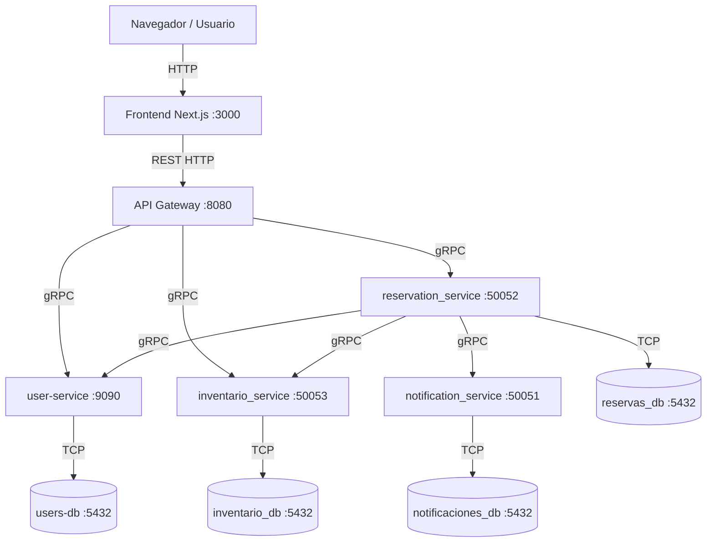
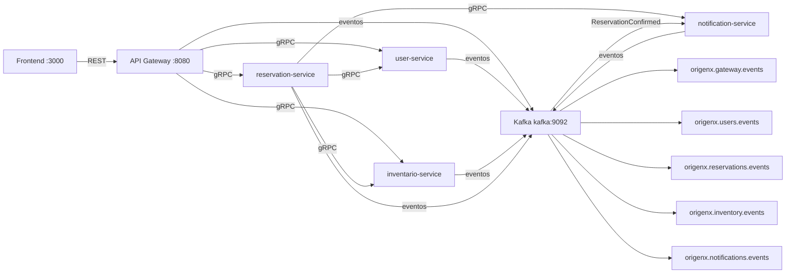

# Origen X - Sistema de Reserva de Hoteles

## 1. Descripción
Plataforma distribuida basada en microservicios para la gestión de reservas hoteleras. Permite el registro de usuarios, búsqueda de disponibilidad de habitaciones y creación de reservas con notificaciones automáticas.

### Tecnologías principales
*   **Backend:** Java (Spring Boot), Go, Python (FastAPI).
*   **Comunicación:** gRPC (Interno) y REST (Externo).
*   **Mensajeria transversal:** Apache Kafka como componente de apoyo, sin reemplazar gRPC.
*   **Persistencia:** PostgreSQL (Base de datos por servicio).
*   **Infraestructura:** Docker / Docker Compose.
*   **Frontend:** Next.js / React.

---

## 2. Arquitectura resumida
El sistema utiliza un **API Gateway** como punto de entrada único, delegando las responsabilidades a servicios especializados con persistencia aislada.


```mermaid
graph TD
    Browser[Navegador / Usuario]
    Frontend[Frontend Next.js :3000]
    Gateway[API Gateway :8080]

    Browser -->|HTTP| Frontend
    Frontend -->|REST HTTP| Gateway

    Gateway -->|gRPC| UserService[user-service :9090]
    Gateway -->|gRPC| InventoryService[inventario_service :50053]
    Gateway -->|gRPC| ReservationService[reservation_service :50052]

    ReservationService -->|gRPC| UserService
    ReservationService -->|gRPC| InventoryService
    ReservationService -->|gRPC| NotificationService[notification_service :50051]

    UserService -->|TCP| UserDB[(users-db :5432)]
    InventoryService -->|TCP| InvDB[(inventario_db :5432)]
    ReservationService -->|TCP| ResDB[(reservas_db :5432)]
    NotificationService -->|TCP| NotifDB[(notificaciones_db :5432)]
```

---

## 3. Configuración y Despliegue

### Variables de Entorno (.env)
Asegúrese de configurar las siguientes variables mínimas:
```env
DB_USER=postgres
DB_PASSWORD=secretpassword
RESEND_API_KEY=re_123456789_dummy_key
RESEND_FROM_EMAIL=onboarding@resend.dev
```

### Levantamiento con Docker
```bash
# 0. Validar configuracion
docker compose config

# 1. Construir imágenes
docker compose build

# 2. Iniciar servicios
docker compose up -d

# 3. Verificar estado
docker compose ps
```

---

## 4. Integración Kafka como bus de eventos transversal

Kafka se agrega como bus de eventos transversal para eventos asincronicos, auditoria, trazabilidad y desacoplamiento. **Kafka no reemplaza gRPC**: gRPC se mantiene como mecanismo principal para operaciones sincronicas entre microservicios, mientras Kafka publica hechos relevantes del sistema para observacion e integraciones futuras.

Los servicios reciben estas variables de entorno:

```env
KAFKA_BOOTSTRAP_SERVERS=kafka:9092
KAFKA_CLIENT_ID=<nombre-del-servicio>
```

Servicios configurados con acceso a Kafka:

*   `api_gateway`
*   `user-service`
*   `inventario_service`
*   `reservation_service`
*   `notification_service`

Kafka queda disponible dentro de la red Docker con el host:

```text
kafka:9092
```

Kafka UI queda disponible en:

```text
http://localhost:8082
```

### Contratos de eventos

Los contratos JSON de eventos Kafka estan documentados en:

```text
contracts/events/
```

El documento principal es `contracts/events/README.md` e incluye el sobre comun de evento, reglas de versionado, idempotencia, trazabilidad, seguridad de datos y ejemplos.

Topicos definidos:

*   `origenx.users.events`
*   `origenx.reservations.events`
*   `origenx.inventory.events`
*   `origenx.notifications.events`
*   `origenx.gateway.events`
*   `origenx.events.dlq`

### Tabla final de servicios y topicos

| Servicio | Rol Kafka | Tópico | Eventos |
|---|---|---|---|
| `api-gateway` | Productor | `origenx.gateway.events` | `GatewayUserRegistered`, `GatewayUserLoggedIn`, `GatewayInventorySearchRequested`, `GatewayReservationRequested` |
| `user-service` | Productor | `origenx.users.events` | `UserCreated`, `UserUpdated`, `UserLoggedIn` |
| `reservation-service` | Productor | `origenx.reservations.events` | `ReservationCreated`, `ReservationConfirmed`, `ReservationFailed` |
| `inventario-service` | Productor | `origenx.inventory.events` | `InventoryStockBlocked`, `InventoryStockReleased`, `InventoryStockFailed` |
| `notification-service` | Consumidor/Productor | consume `origenx.reservations.events`, publica `origenx.notifications.events` | consume `ReservationConfirmed`; publica `NotificationSent`, `NotificationFailed` |

### Arquitectura con Kafka


```mermaid
flowchart LR
    Frontend["Frontend :3000"] -->|"REST"| Gateway["API Gateway :8080"]
    Gateway -->|"gRPC"| User["user-service"]
    Gateway -->|"gRPC"| Inventory["inventario-service"]
    Gateway -->|"gRPC"| Reservation["reservation-service"]
    Reservation -->|"gRPC"| User
    Reservation -->|"gRPC"| Inventory
    Reservation -->|"gRPC"| Notification["notification-service"]
    Gateway -->|"eventos"| Kafka["Kafka kafka:9092"]
    User -->|"eventos"| Kafka
    Inventory -->|"eventos"| Kafka
    Reservation -->|"eventos"| Kafka
    Kafka -->|"ReservationConfirmed"| Notification
    Notification -->|"eventos"| Kafka
    Kafka --> GatewayTopic["origenx.gateway.events"]
    Kafka --> UserTopic["origenx.users.events"]
    Kafka --> ReservationTopic["origenx.reservations.events"]
    Kafka --> InventoryTopic["origenx.inventory.events"]
    Kafka --> NotificationTopic["origenx.notifications.events"]
```

### Eventos publicados por user-service

`user-service` mantiene gRPC como mecanismo principal para registro, actualizacion y autenticacion de usuarios. Como apoyo transversal, cuando `KAFKA_ENABLED=true`, publica eventos JSON en el topico:

```text
origenx.users.events
```

Eventos publicados:

*   `UserCreated`: despues de crear un usuario correctamente.
*   `UserUpdated`: despues de actualizar correctamente el perfil de usuario.
*   `UserLoggedIn`: despues de una autenticacion exitosa, sin publicar password, token ni secretos.

Kafka es resiliente para este flujo: si `KAFKA_ENABLED=false` o Kafka no esta disponible, las operaciones gRPC siguen funcionando igual que antes y el error queda registrado en logs.

Variables usadas por `user-service`:

```env
KAFKA_ENABLED=true
KAFKA_BOOTSTRAP_SERVERS=kafka:9092
KAFKA_USERS_TOPIC=origenx.users.events
KAFKA_CLIENT_ID=user-service
```

Para ver los eventos desde consola:

```bash
docker compose exec kafka sh -lc '/opt/kafka/bin/kafka-console-consumer.sh --bootstrap-server kafka:9092 --topic origenx.users.events --from-beginning'
```

La prueba manual recomendada es crear un usuario desde el frontend, editar el perfil y luego iniciar sesion para verificar `UserCreated`, `UserUpdated` y `UserLoggedIn`.

### Eventos publicados por api-gateway

`api-gateway` mantiene REST hacia el frontend y gRPC hacia los microservicios. Como apoyo transversal, cuando `KAFKA_ENABLED=true`, publica eventos de auditoria/trazabilidad en:

```text
origenx.gateway.events
```

Eventos publicados:

*   `GatewayUserRegistered`: registro exitoso, sin password.
*   `GatewayUserLoggedIn`: login exitoso, sin tokens ni credenciales.
*   `GatewayInventorySearchRequested`: busqueda de habitaciones con filtros no sensibles.
*   `GatewayReservationRequested`: solicitud de reserva sin Authorization header ni Bearer token.

Variables usadas por `api-gateway`:

```env
KAFKA_ENABLED=true
KAFKA_BOOTSTRAP_SERVERS=kafka:9092
KAFKA_GATEWAY_TOPIC=origenx.gateway.events
KAFKA_CLIENT_ID=api-gateway
```

Para ver eventos:

```bash
docker compose exec kafka sh -lc '/opt/kafka/bin/kafka-console-consumer.sh --bootstrap-server kafka:9092 --topic origenx.gateway.events --from-beginning'
```

### Eventos publicados por reservation-service

`reservation-service` mantiene su flujo gRPC actual y ahora publica eventos JSON en el topico:

```text
origenx.reservations.events
```

Eventos publicados:

*   `ReservationCreated`: al iniciar el proceso de creacion de reserva.
*   `ReservationConfirmed`: despues de guardar correctamente la reserva en PostgreSQL.
*   `ReservationFailed`: antes de retornar errores controlados durante la creacion.

Kafka es resiliente para este flujo: si `KAFKA_ENABLED=false` o Kafka no esta disponible, la reserva sigue funcionando igual que antes y el error queda registrado en logs.

Variables usadas por `reservation-service`:

```env
KAFKA_ENABLED=true
KAFKA_BOOTSTRAP_SERVERS=kafka:9092
KAFKA_RESERVATIONS_TOPIC=origenx.reservations.events
KAFKA_CLIENT_ID=reservation-service
```

Para ver los eventos desde consola:

```bash
docker compose exec kafka /opt/kafka/bin/kafka-console-consumer.sh --bootstrap-server kafka:9092 --topic origenx.reservations.events --from-beginning
```

Tambien se pueden ver desde Kafka UI en `http://localhost:8082`.

### Eventos publicados por inventario-service

`inventario-service` mantiene gRPC como mecanismo principal para bloquear y liberar stock. Como apoyo transversal, cuando `KAFKA_ENABLED=true`, publica eventos JSON en el topico:

```text
origenx.inventory.events
```

Eventos publicados:

*   `InventoryStockBlocked`: despues de bloquear stock correctamente.
*   `InventoryStockReleased`: despues de liberar stock correctamente.
*   `InventoryStockFailed`: cuando no hay stock suficiente o falla una operacion de inventario.

Kafka es resiliente para este flujo: si `KAFKA_ENABLED=false` o Kafka no esta disponible, el bloqueo/liberacion por gRPC sigue funcionando igual que antes y el error queda registrado en logs.

Variables usadas por `inventario-service`:

```env
KAFKA_ENABLED=true
KAFKA_BOOTSTRAP_SERVERS=kafka:9092
KAFKA_INVENTORY_TOPIC=origenx.inventory.events
KAFKA_CLIENT_ID=inventario-service
```

Para ver los eventos desde consola:

```bash
docker compose exec kafka sh -lc '/opt/kafka/bin/kafka-console-consumer.sh --bootstrap-server kafka:9092 --topic origenx.inventory.events --from-beginning'
```

La prueba manual recomendada es crear una reserva desde el frontend y verificar que se publique `InventoryStockBlocked`.

### Eventos consumidos y publicados por notification-service

`notification-service` mantiene disponible su servidor gRPC y ademas, cuando `KAFKA_ENABLED=true`, consume eventos desde:

```text
origenx.reservations.events
```

Evento consumido:

*   `ReservationConfirmed`: procesa la confirmacion de reserva y registra/envia la notificacion reutilizando la logica existente del servicio.

Eventos ignorados:

*   `ReservationCreated`
*   `ReservationFailed`
*   `ReservationCancelled`
*   cualquier `event_type` no soportado

Luego publica el resultado en:

```text
origenx.notifications.events
```

Eventos publicados:

*   `NotificationSent`: si la notificacion fue procesada correctamente.
*   `NotificationFailed`: si hubo un error controlado al procesarla.

Para evitar duplicados mientras `reservation-service` sigue llamando por gRPC, la idempotencia usa la clave logica:

```text
reservation-confirmation:<reservation_id>
```

Variables usadas por `notification-service`:

```env
KAFKA_ENABLED=true
KAFKA_BOOTSTRAP_SERVERS=kafka:9092
KAFKA_RESERVATIONS_TOPIC=origenx.reservations.events
KAFKA_NOTIFICATIONS_TOPIC=origenx.notifications.events
KAFKA_CONSUMER_GROUP=notification-service
KAFKA_CLIENT_ID=notification-service
```

### Verificar que Kafka esta activo

1. Validar que la configuracion de Docker Compose es correcta:

```bash
docker compose config
```

2. Levantar el stack:

```bash
docker compose build
docker compose up -d
docker compose ps
```

3. Confirmar que `kafka` y `kafka-ui` estan en estado `running` o `healthy`:

```bash
docker compose ps kafka kafka-ui
```

4. Listar topicos desde el contenedor de Kafka:

```bash
docker compose exec kafka /opt/kafka/bin/kafka-topics.sh --bootstrap-server kafka:9092 --list
```

5. Crear un topico de prueba opcional:

```bash
docker compose exec kafka /opt/kafka/bin/kafka-topics.sh --bootstrap-server kafka:9092 --create --if-not-exists --topic origen-x-test --partitions 1 --replication-factor 1
```

6. Verificar el topico creado:

```bash
docker compose exec kafka /opt/kafka/bin/kafka-topics.sh --bootstrap-server kafka:9092 --describe --topic origen-x-test
```

Tambien se puede ingresar a Kafka UI en `http://localhost:8082` y revisar visualmente los topicos del cluster `origen-x`.

### Consumers por consola

```bash
docker compose exec kafka sh -lc '/opt/kafka/bin/kafka-console-consumer.sh --bootstrap-server kafka:9092 --topic origenx.gateway.events --from-beginning'
docker compose exec kafka sh -lc '/opt/kafka/bin/kafka-console-consumer.sh --bootstrap-server kafka:9092 --topic origenx.users.events --from-beginning'
docker compose exec kafka sh -lc '/opt/kafka/bin/kafka-console-consumer.sh --bootstrap-server kafka:9092 --topic origenx.reservations.events --from-beginning'
docker compose exec kafka sh -lc '/opt/kafka/bin/kafka-console-consumer.sh --bootstrap-server kafka:9092 --topic origenx.inventory.events --from-beginning'
docker compose exec kafka sh -lc '/opt/kafka/bin/kafka-console-consumer.sh --bootstrap-server kafka:9092 --topic origenx.notifications.events --from-beginning'
```

### Prueba end-to-end desde frontend

1. Levantar el stack:

```bash
docker compose up -d
docker compose ps
```

2. Abrir `http://localhost:3000` y Kafka UI en `http://localhost:8082`.
3. Crear usuario. Eventos esperados: `GatewayUserRegistered`, `UserCreated`.
4. Iniciar sesion. Eventos esperados: `GatewayUserLoggedIn`, `UserLoggedIn`.
5. Buscar habitaciones. Evento esperado: `GatewayInventorySearchRequested`.
6. Crear reserva. Eventos esperados: `GatewayReservationRequested`, `ReservationCreated`, `InventoryStockBlocked`, `ReservationConfirmed`, `NotificationSent`.
7. Editar perfil. Evento esperado: `UserUpdated`.

### Troubleshooting Kafka

| Problema | Solucion |
|---|---|
| Puerto `8080` ocupado | Liberar el puerto o cambiar el puerto publicado de `api_gateway` en `docker-compose.yml`. |
| Git Bash convierte rutas `/opt/kafka` | Usar `docker compose exec kafka sh -lc '...'` como en los comandos de consumer. |
| Kafka aun no esta healthy | Esperar `docker compose ps kafka`; el healthcheck puede tardar despues del arranque. |
| `UNKNOWN_TOPIC_OR_PARTITION` | Ejecutar una accion que publique en el topico o listar/crear topicos; Kafka tiene auto-create habilitado. |
| Warnings `RESEND_API_KEY` o `USER_SERVICE_HOST` | Son variables opcionales/no seteadas en algunos servicios; no bloquean Kafka. |
| Consumer no muestra eventos antiguos | El topico puede estar vacio, el evento no se publico aun o se esta usando otro topico. Con `--from-beginning` se leen mensajes retenidos. |

Documentacion ampliada:

*   `docs/KAFKA_INTEGRATION_REPORT.md`
*   `docs/KAFKA_DEMO_GUIDE.md`

## Documentación Kafka

La integración Kafka se documenta como una capa transversal de eventos. REST y gRPC se mantienen para el flujo principal del sistema.

*   `docs/KAFKA_TECHNICAL_DOCUMENT.md`
*   `docs/KAFKA_VIDEO_DEMO_SCRIPT.md`
*   `docs/KAFKA_INTEGRATION_REPORT.md`
*   `docs/KAFKA_DEMO_GUIDE.md`

---

## 5. Cómo probar el sistema

Para validar el funcionamiento del sistema, se pueden realizar peticiones directamente al **API Gateway** (`localhost:8080`). A continuación, se presentan ejemplos para entornos Windows (PowerShell) y Linux/macOS (curl).

### 5.1 Pruebas desde Terminal
Se proporcionan ambas versiones para asegurar la compatibilidad multiplataforma:
*   **Windows:** Se recomienda `Invoke-RestMethod` en PowerShell para un manejo nativo de objetos JSON.
*   **Linux/macOS:** Se recomienda `curl` por ser el estándar en sistemas tipo Unix.

**1. Crear un usuario:**
```powershell
Invoke-RestMethod -Uri "http://localhost:8080/users" -Method Post -Headers @{"Content-Type"="application/json"} -Body '{"nombre": "Juan Perez", "email": "juan@test.com", "password": "pass", "telefono": "123456"}'
```

```bash
curl -X POST http://localhost:8080/users \
     -H "Content-Type: application/json" \
     -d '{"nombre": "Juan Perez", "email": "juan@test.com", "password": "pass", "telefono": "123456"}'
```

**2. Login:**
```powershell
Invoke-RestMethod -Uri "http://localhost:8080/login" -Method Post -Headers @{"Content-Type"="application/json"} -Body '{"email": "juan@test.com", "password": "pass"}'
```

```bash
curl -X POST http://localhost:8080/login \
     -H "Content-Type: application/json" \
     -d '{"email": "juan@test.com", "password": "pass"}'
```

**3. Buscar habitaciones:**
```powershell
Invoke-RestMethod -Uri "http://localhost:8080/api/inventory/search" -Method Post -Headers @{"Content-Type"="application/json"} -Body '{"fecha_inicio": "2026-06-01", "fecha_fin": "2026-06-10", "ubicacion": "", "precio_max": 999999, "capacidad": 2}'
```

```bash
curl -X POST http://localhost:8080/api/inventory/search \
     -H "Content-Type: application/json" \
     -d '{"fecha_inicio": "2026-06-01", "fecha_fin": "2026-06-10", "ubicacion": "", "precio_max": 999999, "capacidad": 2}'
```

**4. Crear una reserva:**
*(Debes reemplazar los IDs con valores válidos obtenidos de los pasos anteriores).*
```powershell
Invoke-RestMethod -Uri "http://localhost:8080/reservations" -Method Post -Headers @{"Content-Type"="application/json"} -Body '{"user_id": "ID_DEL_USUARIO", "hotel_id": "HOTEL_1", "room_type_id": "ROOM_1", "fecha_inicio": "2026-06-01", "fecha_fin": "2026-06-10"}'
```

```bash
curl -X POST http://localhost:8080/reservations \
     -H "Content-Type: application/json" \
     -d '{"user_id": "ID_DEL_USUARIO", "hotel_id": "HOTEL_1", "room_type_id": "ROOM_1", "fecha_inicio": "2026-06-01", "fecha_fin": "2026-06-10"}'
```

**5. Listar reservas del usuario logueado:**
```powershell
Invoke-RestMethod -Uri "http://localhost:8080/reservations" -Method Get -Headers @{ Authorization = "Bearer <ACCESS_TOKEN>" }
```

```bash
curl -H "Authorization: Bearer <ACCESS_TOKEN>" http://localhost:8080/reservations
```

### 5.2 Pruebas desde Interfaz Web (Frontend)
El sistema incluye un frontend web mínimo disponible en:
*   **URL:** `http://localhost:3000`(tanto usuarios como reservas)

**Consideraciones:**
*   El frontend consume directamente el **API Gateway** expuesto en el puerto `8080`.
*   Permite validar visualmente parte del flujo (ej. listado de hoteles o disponibilidad).
*   **Nota Técnica:** Las pruebas por terminal (PowerShell/curl) siguen siendo las más completas para tareas de depuración y validación de las respuestas exactas de los microservicios.

### 5.3 Verificación de notificaciones

Las notificaciones del sistema se realizan internamente mediante comunicación gRPC. Cuando el `reservation_service` confirma una reserva, este invoca automáticamente al `notification_service`.

Para verificar que la integración es correcta y que las notificaciones se están procesando, puedes monitorear los logs del contenedor de notificaciones:

```bash
docker compose logs --tail 30 notification_service
```

**Resultado esperado:**
Deberías ver un log que confirme el procesamiento de la notificación, similar a:
```text
Notificación guardada: user=..., reservation=..., tipo=CONFIRMACION
```

---
