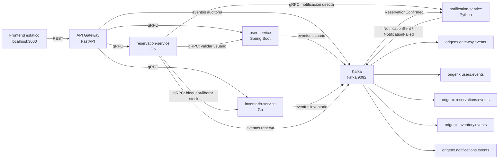
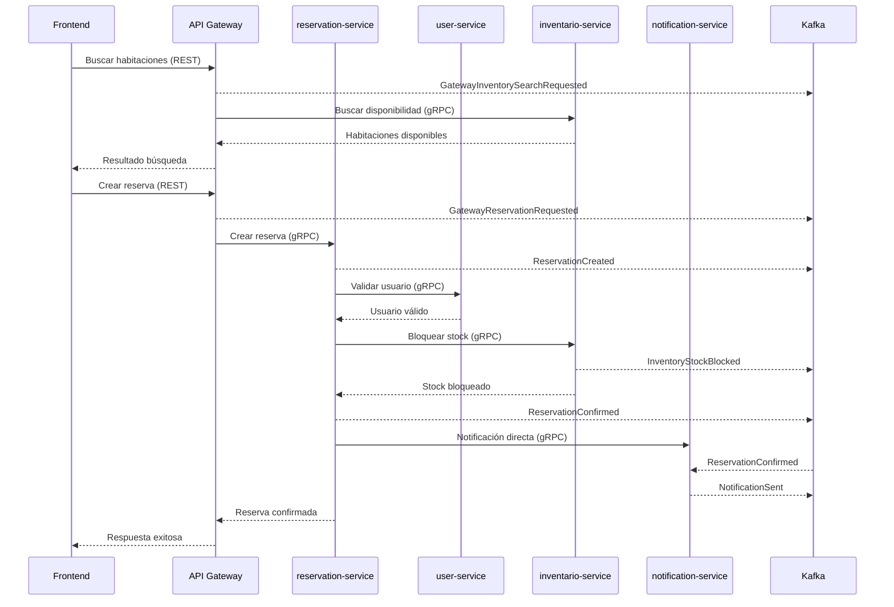

# Documento técnico: Integración de Kafka en Origen X

## 1. Introducción

Origen X es una plataforma distribuida de reservas hoteleras basada en microservicios. El sistema permite registrar usuarios, iniciar sesión, buscar disponibilidad de habitaciones, crear reservas y generar notificaciones asociadas al flujo de reserva.

El objetivo arquitectónico del proyecto es separar responsabilidades por dominio, facilitar el despliegue con Docker Compose y mantener comunicación clara entre servicios. En esta etapa se incorporó Apache Kafka como bus transversal de eventos asincrónicos, sin reemplazar la comunicación existente por REST ni gRPC.

## 2. Arquitectura base del sistema

Antes de incorporar Kafka, Origen X ya contaba con una arquitectura distribuida compuesta por:

- Frontend estático para la interacción del usuario.
- API Gateway implementado en Python/FastAPI.
- user-service implementado en Java/Spring Boot.
- inventario-service implementado en Go.
- reservation-service implementado en Go.
- notification-service implementado en Python.
- PostgreSQL independiente por servicio.
- Comunicación externa REST desde el frontend hacia el API Gateway.
- Comunicación interna principal mediante gRPC.
- Despliegue local mediante Docker Compose.

En esta arquitectura base, el frontend no se comunica directamente con los microservicios internos. Las solicitudes entran por el API Gateway y luego se coordinan con los servicios mediante gRPC. Por lo tanto, antes de Kafka el sistema ya era distribuido y ya utilizaba comunicación entre servicios.

## 3. Motivación para incorporar Kafka

Kafka se agregó para complementar la arquitectura con una capa transversal de eventos. Las motivaciones principales fueron:

- Registrar eventos asincrónicos generados por acciones relevantes del sistema.
- Mejorar auditoría de operaciones realizadas desde el frontend.
- Aumentar trazabilidad del flujo distribuido.
- Desacoplar la emisión de hechos de dominio respecto de futuros consumidores.
- Facilitar extensibilidad futura sin modificar el flujo principal.
- Mejorar la observabilidad del comportamiento distribuido.
- Permitir integrar nuevos consumidores, como analítica o auditoría, sin alterar endpoints ni contratos gRPC.

Kafka no reemplaza gRPC. gRPC se mantiene para operaciones sincrónicas que requieren respuesta inmediata, como validar usuarios, bloquear inventario o coordinar la creación de una reserva.

## 4. Decisión arquitectónica: gRPC + Kafka

La integración final usa REST, gRPC y Kafka con responsabilidades distintas:

- REST comunica el frontend con el API Gateway.
- gRPC mantiene la coordinación sincrónica entre microservicios.
- Kafka publica eventos asincrónicos para auditoría, trazabilidad y desacoplamiento.

| Tecnología | Uso en Origen X | Tipo de comunicación | Ejemplo |
|---|---|---|---|
| REST | Comunicación frontend/API Gateway | Sincrónica | Crear usuario desde frontend |
| gRPC | Comunicación interna entre microservicios | Sincrónica | reservation-service bloquea stock en inventario-service |
| Kafka | Bus de eventos transversal | Asincrónica | ReservationConfirmed, NotificationSent |

Esta decisión conserva el comportamiento funcional existente y agrega eventos sin convertirlos en una dependencia obligatoria para completar las operaciones principales.

## 5. Arquitectura final con Kafka



Kafka queda como una capa transversal. Todos los servicios relevantes pueden publicar eventos, y notification-service además consume eventos de reserva para reaccionar a confirmaciones.

## 6. Tópicos Kafka implementados

| Tópico | Productor principal | Consumidor principal | Propósito |
|---|---|---|---|
| origenx.gateway.events | api-gateway | Auditoría futura / observabilidad | Registrar acciones externas recibidas por REST |
| origenx.users.events | user-service | Auditoría futura / analítica futura | Registrar eventos de ciclo de vida de usuarios |
| origenx.reservations.events | reservation-service | notification-service | Registrar eventos de creación, confirmación y fallo de reservas |
| origenx.inventory.events | inventario-service | Auditoría futura / analítica futura | Registrar eventos de bloqueo, liberación y fallo de stock |
| origenx.notifications.events | notification-service | Auditoría futura / observabilidad | Registrar resultado del procesamiento de notificaciones |
| origenx.events.dlq | Pendiente | Pendiente | Tópico documentado como contrato/mejora futura para mensajes fallidos |

El tópico `origenx.events.dlq` queda definido como parte del contrato y como mejora futura si no está implementado funcionalmente en todos los servicios.

## 7. Eventos implementados por servicio

### 7.1 API Gateway

El API Gateway recibe las solicitudes HTTP desde el frontend y coordina llamadas gRPC hacia los microservicios. Como productor Kafka, publica eventos de auditoría y trazabilidad en el tópico `origenx.gateway.events`.

Eventos publicados:

- GatewayUserRegistered.
- GatewayUserLoggedIn.
- GatewayInventorySearchRequested.
- GatewayReservationRequested.

Estos eventos permiten observar solicitudes externas relevantes sin modificar los endpoints REST. El API Gateway no publica passwords, tokens, Authorization headers ni secretos.

### 7.2 user-service

user-service administra registro, autenticación y actualización de usuarios. Publica eventos en `origenx.users.events`.

Eventos publicados:

- UserCreated: después de crear exitosamente un usuario.
- UserUpdated: después de actualizar exitosamente el perfil de un usuario.
- UserLoggedIn: después de un inicio de sesión exitoso, sin exponer tokens.

Los eventos de usuario no incluyen passwords, tokens ni secretos. El objetivo es registrar hechos del dominio de usuarios para trazabilidad y auditoría.

### 7.3 reservation-service

reservation-service coordina la creación de reservas. Usa gRPC para validar usuario, bloquear inventario y mantener la notificación directa existente.

Publica eventos en `origenx.reservations.events`:

- ReservationCreated: cuando inicia el proceso de creación de reserva.
- ReservationConfirmed: después de guardar correctamente la reserva.
- ReservationFailed: cuando ocurre un error controlado durante la creación.

La creación de reserva sigue usando gRPC para coordinar usuario, inventario y notificación. Kafka solo registra eventos asociados al flujo.

### 7.4 inventario-service

inventario-service administra disponibilidad, bloqueo y liberación de stock. Publica eventos en `origenx.inventory.events`.

Eventos publicados:

- InventoryStockBlocked: después de bloquear stock exitosamente.
- InventoryStockReleased: después de liberar stock exitosamente.
- InventoryStockFailed: cuando no hay stock suficiente o falla una operación de inventario.

El bloqueo y liberación de stock siguen siendo operaciones gRPC porque requieren respuesta inmediata para decidir si una reserva puede continuar.

### 7.5 notification-service

notification-service mantiene disponible su servidor gRPC por compatibilidad con el flujo existente. Además, cuando Kafka está habilitado, consume eventos desde `origenx.reservations.events`.

Evento consumido:

- ReservationConfirmed.

Eventos publicados en `origenx.notifications.events`:

- NotificationSent.
- NotificationFailed.

El servicio usa idempotencia para evitar duplicados, ya que durante esta integración la confirmación puede llegar por gRPC y también por Kafka.

## 8. Formato común de eventos

Todos los eventos se documentan como JSON y usan un sobre común:

```json
{
  "event_id": "uuid",
  "event_type": "ReservationConfirmed",
  "version": 1,
  "source_service": "reservation-service",
  "occurred_at": "2026-07-05T16:00:00Z",
  "correlation_id": "uuid-opcional",
  "payload": {}
}
```

Campos:

- `event_id`: identificador único del evento.
- `event_type`: tipo del evento.
- `version`: versión del contrato.
- `source_service`: servicio que emite el evento.
- `occurred_at`: fecha y hora en UTC.
- `correlation_id`: identificador opcional para trazabilidad entre operaciones.
- `payload`: datos propios del evento.

## 9. Flujo completo de reserva con Kafka

El flujo de reserva mantiene la coordinación principal por REST y gRPC, y Kafka registra eventos relevantes:

1. Usuario busca habitaciones.
2. API Gateway publica GatewayInventorySearchRequested.
3. Usuario solicita reserva.
4. API Gateway publica GatewayReservationRequested.
5. API Gateway llama por gRPC a reservation-service.
6. reservation-service publica ReservationCreated.
7. reservation-service valida usuario por gRPC.
8. reservation-service bloquea inventario por gRPC.
9. inventario-service publica InventoryStockBlocked.
10. reservation-service guarda reserva.
11. reservation-service publica ReservationConfirmed.
12. notification-service consume ReservationConfirmed.
13. notification-service evita duplicados por idempotencia.
14. notification-service publica NotificationSent.



## 10. Idempotencia en notification-service

Como todavía existe una llamada gRPC directa desde reservation-service hacia notification-service, puede llegar la misma confirmación por dos caminos:

- gRPC.
- Kafka.

Para evitar duplicar notificaciones se usa la clave lógica:

```text
reservation-confirmation:<reservation_id>
```

No basta con usar únicamente `event_id` porque ese identificador cambia por cada evento emitido. En cambio, `reservation_id` representa la operación de negocio que debe protegerse: la confirmación de una reserva específica. La idempotencia se define sobre la acción de negocio, no sobre el mensaje individual.

## 11. Manejo de errores y tolerancia a fallos

Kafka se integra con una estrategia best effort:

- Si Kafka falla, la operación principal no falla.
- `KAFKA_ENABLED` permite activar o desactivar Kafka por entorno.
- Los errores de publicación quedan registrados en logs.
- notification-service puede seguir levantando su servidor gRPC aunque Kafka no esté disponible.
- La reserva no depende de Kafka para completarse.
- Los productores no deben bloquear el flujo principal más de lo necesario.

Esta decisión evita que el bus de eventos se convierta en un punto único de falla para el flujo funcional.

## 12. Seguridad de eventos

Los eventos publicados contienen solo datos necesarios para trazabilidad y auditoría. Se evita publicar información sensible:

- No se publican passwords.
- No se publican tokens.
- No se publican Authorization headers.
- No se publican secretos.
- No se incluyen datos sensibles innecesarios en los payloads.

Esta regla aplica especialmente a eventos de registro, login y solicitudes que provienen del frontend.

## 13. Configuración Docker Compose

Docker Compose incluye Kafka y Kafka UI. La configuración base utiliza:

- `kafka` como broker interno.
- `kafka-ui` como interfaz web.
- `KAFKA_BOOTSTRAP_SERVERS=kafka:9092`.
- `KAFKA_ENABLED` para activar o desactivar integración Kafka.
- `KAFKA_CLIENT_ID` por servicio.
- Variables por tópico según el dominio:
  - `KAFKA_GATEWAY_TOPIC=origenx.gateway.events`.
  - `KAFKA_USERS_TOPIC=origenx.users.events`.
  - `KAFKA_RESERVATIONS_TOPIC=origenx.reservations.events`.
  - `KAFKA_INVENTORY_TOPIC=origenx.inventory.events`.
  - `KAFKA_NOTIFICATIONS_TOPIC=origenx.notifications.events`.

URLs relevantes:

- Kafka UI: `http://localhost:8082`.
- Frontend: `http://localhost:3000`.
- API Gateway: `http://localhost:8080`.

## 14. Validación realizada

La integración fue validada con:

- `docker compose config`.
- `docker compose build`.
- `docker compose up -d`.
- `docker compose ps`.
- `go test ./...` en `mi-servicio`.
- `go test ./...` en `inventario-service`.
- `pytest tests/test_kafka_events.py` en `notification_service`.
- `pytest tests/test_kafka_events.py` en `api-gateway`.
- `mvn test` en `user-service`.
- Prueba manual desde frontend creando usuario, iniciando sesión, buscando habitaciones y creando reserva.

## 15. Evidencia esperada en Kafka

| Acción en frontend | Tópicos involucrados | Eventos esperados |
|---|---|---|
| Crear usuario | `origenx.gateway.events`, `origenx.users.events` | GatewayUserRegistered, UserCreated |
| Iniciar sesión | `origenx.gateway.events`, `origenx.users.events` | GatewayUserLoggedIn, UserLoggedIn |
| Buscar habitaciones | `origenx.gateway.events` | GatewayInventorySearchRequested |
| Crear reserva | `origenx.gateway.events`, `origenx.reservations.events`, `origenx.inventory.events`, `origenx.notifications.events` | GatewayReservationRequested, ReservationCreated, InventoryStockBlocked, ReservationConfirmed, NotificationSent |
| Editar perfil | `origenx.users.events` | UserUpdated |

## 16. Limitaciones actuales

- Kafka no es obligatorio para completar la reserva.
- DLQ queda documentado como mejora futura si no está implementado funcionalmente.
- No se implementaron sagas completas.
- Inventario sigue bloqueándose por gRPC.
- Kafka se usa principalmente para eventos, auditoría y trazabilidad.
- No se usa Schema Registry.
- Los eventos usan JSON simple.

## 17. Mejoras futuras

- Implementar una DLQ real para mensajes fallidos.
- Agregar reintentos avanzados y políticas de backoff por consumidor.
- Evolucionar hacia sagas o coreografía de reservas cuando sea necesario.
- Incorporar correlación distribuida completa.
- Definir particionado por usuario o reserva.
- Agregar Schema Registry.
- Evaluar Avro o Protobuf para eventos.
- Agregar monitoreo específico de Kafka.
- Crear alertas por fallos de publicación o consumo de eventos.
- Agregar consumidores adicionales para analítica o auditoría.

## 18. Conclusión

Kafka fortalece el carácter distribuido de Origen X sin romper la arquitectura existente. La integración agrega una capa transversal para observar hechos relevantes del sistema y habilitar extensiones futuras.

Kafka fue incorporado como una capa transversal de eventos asincrónicos. gRPC se mantiene para operaciones sincrónicas que requieren respuesta inmediata.
