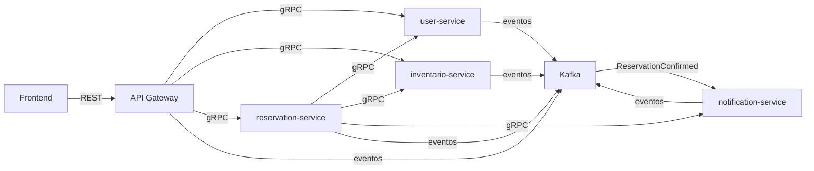

# Kafka Integration Report - Origen X

## Resumen

Origen X integra Apache Kafka como bus de eventos transversal para auditoria, trazabilidad, eventos asincronicos y desacoplamiento progresivo. La comunicacion principal entre microservicios sigue siendo gRPC; Kafka no reemplaza ningun contrato Protobuf ni endpoint existente.

## Motivacion tecnica

Kafka permite observar hechos relevantes del sistema sin acoplar directamente a los servicios. Esto facilita auditoria, monitoreo funcional, integraciones futuras, analitica y evolucion hacia consumidores asincronicos sin afectar los flujos sincronicos actuales.

## Arquitectura antes y despues

Antes, el frontend consumia REST en `api-gateway`, y el gateway/servicios resolvian operaciones internas con gRPC. Despues, el flujo sincronico se mantiene igual, pero los servicios publican eventos JSON en topicos Kafka por dominio.

## Servicios y topicos

| Servicio | Rol Kafka | Topico | Eventos |
|---|---|---|---|
| `api-gateway` | Productor | `origenx.gateway.events` | `GatewayUserRegistered`, `GatewayUserLoggedIn`, `GatewayInventorySearchRequested`, `GatewayReservationRequested` |
| `user-service` | Productor | `origenx.users.events` | `UserCreated`, `UserUpdated`, `UserLoggedIn` |
| `reservation-service` | Productor | `origenx.reservations.events` | `ReservationCreated`, `ReservationConfirmed`, `ReservationFailed` |
| `inventario-service` | Productor | `origenx.inventory.events` | `InventoryStockBlocked`, `InventoryStockReleased`, `InventoryStockFailed` |
| `notification-service` | Consumidor/Productor | `origenx.reservations.events`, `origenx.notifications.events` | consume `ReservationConfirmed`; publica `NotificationSent`, `NotificationFailed` |

## Tabla de eventos

| Evento | Productor | Topico | Proposito |
|---|---|---|---|
| `GatewayUserRegistered` | `api-gateway` | `origenx.gateway.events` | Auditoria de registro exitoso desde REST |
| `GatewayUserLoggedIn` | `api-gateway` | `origenx.gateway.events` | Auditoria de login exitoso sin tokens |
| `GatewayInventorySearchRequested` | `api-gateway` | `origenx.gateway.events` | Trazar busquedas de disponibilidad |
| `GatewayReservationRequested` | `api-gateway` | `origenx.gateway.events` | Trazar solicitudes de reserva |
| `UserCreated` | `user-service` | `origenx.users.events` | Usuario creado |
| `UserUpdated` | `user-service` | `origenx.users.events` | Perfil actualizado |
| `UserLoggedIn` | `user-service` | `origenx.users.events` | Autenticacion exitosa sin credenciales |
| `ReservationCreated` | `reservation-service` | `origenx.reservations.events` | Inicio del flujo de reserva |
| `ReservationConfirmed` | `reservation-service` | `origenx.reservations.events` | Reserva persistida correctamente |
| `ReservationFailed` | `reservation-service` | `origenx.reservations.events` | Falla controlada de reserva |
| `InventoryStockBlocked` | `inventario-service` | `origenx.inventory.events` | Stock bloqueado |
| `InventoryStockReleased` | `inventario-service` | `origenx.inventory.events` | Stock liberado |
| `InventoryStockFailed` | `inventario-service` | `origenx.inventory.events` | Falla o stock insuficiente |
| `NotificationSent` | `notification-service` | `origenx.notifications.events` | Notificacion procesada |
| `NotificationFailed` | `notification-service` | `origenx.notifications.events` | Error controlado de notificacion |

## Flujo completo de reserva con Kafka

1. Frontend solicita crear reserva por REST al `api-gateway`.
2. `api-gateway` valida sesion por gRPC y publica `GatewayReservationRequested`.
3. `reservation-service` inicia el flujo y publica `ReservationCreated`.
4. `reservation-service` bloquea stock por gRPC contra `inventario-service`.
5. `inventario-service` publica `InventoryStockBlocked` si el bloqueo fue exitoso.
6. `reservation-service` guarda la reserva y publica `ReservationConfirmed`.
7. `notification-service` consume `ReservationConfirmed`, evita duplicados y publica `NotificationSent` o `NotificationFailed`.

## Flujo de usuario con Kafka

1. Registro desde frontend: `GatewayUserRegistered` y `UserCreated`.
2. Login exitoso: `GatewayUserLoggedIn` y `UserLoggedIn`.
3. Edicion de perfil: `UserUpdated`.

## Decisiones tecnicas

* Eventos JSON con sobre comun en `contracts/events/README.md`.
* Productores best effort: Kafka no rompe la operacion principal.
* `KAFKA_ENABLED` permite desactivar Kafka por entorno.
* Topicos por dominio para ordenar responsabilidades.
* No se publican passwords, tokens, headers `Authorization` ni secretos.

## Por que se mantuvo gRPC

gRPC sigue siendo la mejor opcion del proyecto para operaciones sincronicas que requieren respuesta inmediata, contratos fuertemente tipados y control claro de errores. Kafka se agrega como canal asincronico complementario, no como reemplazo.

## Manejo de fallos

Si Kafka esta caido o deshabilitado, los servicios siguen respondiendo por REST/gRPC. Los errores de publicacion quedan en logs. `notification-service` reintenta conectarse en background y mantiene su servidor gRPC disponible.

## Idempotencia en notification-service

Como `reservation-service` aun llama a `notification-service` por gRPC y tambien existe el evento `ReservationConfirmed`, el consumidor usa la clave logica `reservation-confirmation:<reservation_id>` para evitar duplicar notificaciones.

## Limitaciones actuales

* No hay Schema Registry.
* No hay DLQ implementada en consumidores reales.
* No todos los eventos tienen consumidores productivos.
* La persistencia de offsets depende del consumer group configurado.
* Los eventos son JSON sin validacion automatica de contrato en runtime.

## Mejoras futuras

* Agregar validacion de contratos JSON Schema.
* Implementar DLQ para consumidores.
* Agregar trazabilidad con `correlation_id` de punta a punta.
* Crear dashboards Kafka en Grafana.
* Agregar consumidores para auditoria y analitica.
